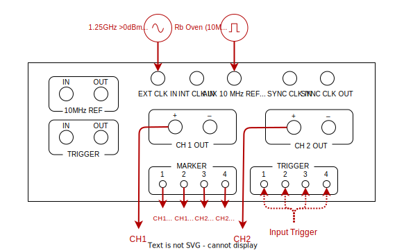

# Agilent N8241A (Driver: Agilent_N8241A)

The Agilent N8241A AWG has:
- 2 AWG outputs capable up to 1.25GSPS, each with 2 markers
- Can operate two units in master-slave mode to phase synchronise the AWGs across 4 output channels

Note that the Trigger IN/OUT channels have longer latencies; so only the 4 *SMB female* trigger ports are used for external triggering.

The unit can be setup in two modes:
- [Single unit acting independently](#default-single-unit-mode)
- [Two separate units synchronised as one](#master-slave-synchronisation-mode)


## Default single unit mode

YAML entry:

```yaml
  Agi1:
    type: sqdtoolz.Drivers.Agilent_N8241A.Agilent_N8241A
    init:
      address: 'TCPIP::192.168.1.101::INSTR'
      ivi_dll: 'C:/Program Files/IVI Foundation/IVI/Bin/AGN6030A.dll'
      init_sync_mode: 'Independent'
      trig_type: 'INT'      #If 'External triggering, set to 'EXT' and trigger via any of the trigger Ports (1,2,3 or 4)
      reset: True
    parameters:
      clock_frequency:
        initial_value: 1.25e9
```

Just set the IP address correctly. If the `ivi_dll` location throws an error (e.g. DLL not found), check that the N8241A IVI drivers have been properly installed. The AWG should be wired up as follows:



Note the following:

- There is only one external trigger; however, it can be fed into any of the 4 SMB trigger ports highlighted.
- Internally, the markers are split equally across the two output channels.
- The setup requires an external sample clock at 1.25GHz at at 0dBm output power. **This signal must be feeding the unit before instantiation** (that is, before calling `load_instrument(Agi1)`).
- The negative outputs do not work (like with the Tektronix AWGs; it only does so when set to differential outputs) for debugging with oscilloscopes etc.


## Master-Slave synchronisation mode

```yaml
  Agi1:
    type: sqdtoolz.Drivers.Agilent_N8241A.Agilent_N8241A
    init:
      address: 'TCPIP::192.168.1.102::INSTR'
      ivi_dll: 'C:/Program Files/IVI Foundation/IVI/Bin/AGN6030A.dll'
      init_sync_mode: 'Master'
      init_clk_src: 'External'
      reset: True
    parameters:
      clock_frequency:
        initial_value: 1.25e9
      m4.source:
        initial_value: 'Hardware Trigger 1'
  Agi2:
    type: sqdtoolz.Drivers.Agilent_N8241A.Agilent_N8241A
    init:
      address: 'TCPIP::192.168.1.101::INSTR'
      ivi_dll: 'C:/Program Files/IVI Foundation/IVI/Bin/AGN6030A.dll'
      init_sync_mode: 'Slave'
      init_clk_src: 'External'
      reset: True
    parameters:
      clock_frequency:
        initial_value: 1.25e9
```

Just set the IP addresses correctly. If the `ivi_dll` location throws an error (e.g. DLL not found), check that the N8241A IVI drivers have been properly installed. The AWG should be wired up as follows:


The master unit is shown on top, while the slave unit is shown on the bottom. Note the following:

- There is only one external trigger; however, it can be fed into any of the first 3 SMB trigger ports highlighted on the master unit.
- Internally, the markers are split equally across the two output channels (with the master unit losing a marker channel on the second channel).
- The setup requires an external sample clock at 1.25GHz at at 0dBm output power. A splitter feeds the signal into both units. **This signal must be feeding both the units before instantiation** (that is, before calling `load_instrument(Agi1)` and `load_instrument(Agi2)`).
- The negative outputs do not work (like with the Tektronix AWGs; it only does so when set to differential outputs) for debugging with oscilloscopes etc.

Note that the drivers must load the master first before instantiating the slave unit (that is, calling [`load_instrument`](../Exp_Overview.md)).
