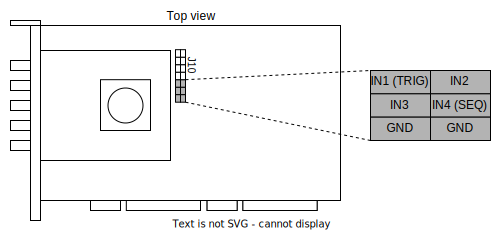

# ETH FPGA (Driver:ACQ_ETH_FPGA)

The ETH FPGA card was developed for ETH (by a now defunc company). Its operations are highlighted in detail in [Deniz Bozyigit's 2010 Masters Thesis](https://qudev.phys.ethz.ch/static/content/science/Documents/master/Bozyigit_Deniz_MasterThesis.pdf). The card has:

- 2 input ports with a fixed 100MSPS sampling rate.
- Onboard demodulation at a frequency of either 10MHz or 25MHz
- Onboard FIR filter
- Onboard math block; currently not supported.
- Onboard decimation
- Onboard averaging


The configuration of the FPGA DSP blocks is done automatically when using the [ProcessorFPGA](../Proc_FPGA_Overview.md) framework. Thus, this document will only highlight the server and client operations:


## Setting up the server

The drivers are currently only tested in Windows XP. Thus, a QTLab driver communicates with the PCIe card. The actual measurement PC running SQDToolz will connect to this Windows XP PC via a Pyro websocket. To connect to this websocket, read the server's URI (universal resource identifier) dump placed on some shared access drive.

Currently, to connect to card:
- Connect to shared drive (where the URI is stored)
- Start the QTLAB FPGA Server on the Windows XP PC. In the resulting console:
  - Hit: `S` and `ENTER`
  - Run: `%gui`
- Monitor the QTLab console for any potential error messages.

If during operation, the card throws an error, reset the FPGA using any/all of the following commands in the QTLab console:
- fpga.reload()
- fpga.reset()


## Setting up the client

YAML entry:

```yaml
  fpga1:
    type: sqdtoolz.Drivers.ACQ_ETH_FPGA.ETHFPGA
    init:
      uri: 'Z:/DataAnalysis/Notebooks/qcodes/FPGA_Rack1_URI.txt'
```

Make sure to set the correct path for the URI. The typical connection setup looks like:


The frequency multiplier box is required to provide the 100MSPS sample clock.

## Maintaining the connectors

There is a jumper header that connects to the four BNC ports in the FPGA card on `J10`. Check the integrity of this connector regularly during maintenance:



The ground pins are tied together internally and can be connected to the BNC shields of all 4 BNC connectors.


## Test setup

The AWG can be used to check the working of and to reprogram the fpga, the wiring for which is shown below


During measurements, the FPGA needs to be wired as below:


